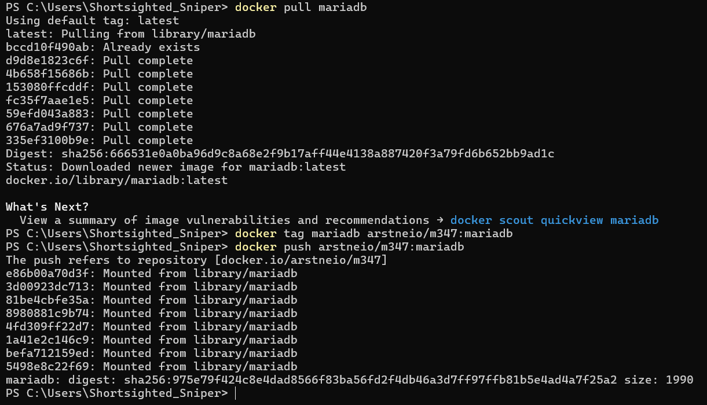

# KN01: Docker Grundlagen

## A) Installation

## B) Docker Command Line Interface

### Aufgabe 1

`docker -v`

### Aufgabe 2

`docker search ubuntu` & `docker search nginx`

### Aufgabe 3

> run soll angeben, dass wir ein container starten möchten

> -d besagt, dass das container im hintergrund laufen sollte

> -p 80:80 besagt, setzte den host port 80 (das erste 80) auf port 80 im container (zweite zahl nach semicolon)

> docker/getting-started ist das image, dass wir laufen möchten

### Aufgabe 4

`docker pull nginx`

`docker create -p 8081:80 nginx:latest`

`docker start <CONTAINER ID>`

#### webpage

### Aufgabe 5

`docker run -d ubuntu`

### Aufgabe 6

### Aufgabe 7

`docker ps` & `docker ps -a`

### Aufgabe 8

`docker stop <CONTAINER NAME>`

### Aufgabe 9

`docker rm <CONTAINER ID>`

## C) Registry und Repository

## D) Privates Repository

`docker tag nginx:latest arstneio/m347:nginx`

mit Tags können wir extra details an einem image geben. Es kann auch als differenzierung von Images helfen mit gleichem package name. es wird meistens für versionen von images bezeichtnet. Zum Beispiel ubuntu:latest oder ubuntu:18.04

`docker push Benutzername/reponame:nginx`

Ich Pushe mein erstelltes image auf meinem Repo. Ich musste zuerst aber mich im docekr hub einloggen.

