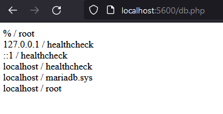

# KN02 Dockerfile

## A) Dockerfile I

```docker
FROM nginx # nimm die docker image from nginx
COPY static-html-directory /var/www/html # kopiere die html ordner vom host auf das html verzeichnis im docker image
EXPOSE 80 # veröffentliche das Port 80 vom image
```

`docker build -t name:tag .`


## B) Dockerfile II

Befehle:

`docker build -t tmtbz/private:kn02b-db -f db.dockerfile .`

`docker build -t tmtbz/private:kn02b-web -f web.dockerfile .`

`docker run -d -p 3306:3306 --name KN02-db tmtbz/private:kn02b-db`

`docker run -d -p 5600:80 --name KN02-web --link KN02-db tmtbz/private:kn02b-web`

`docker push tmtbz/private:kn02b-web`




